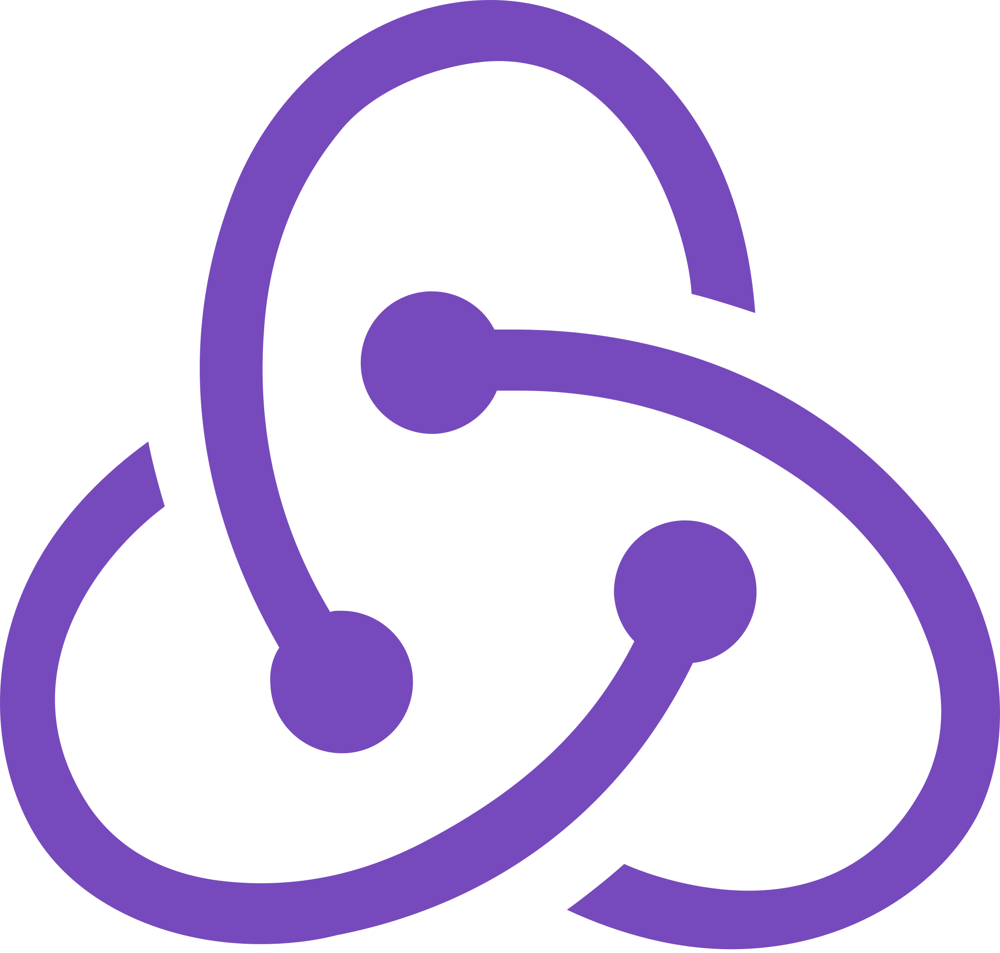

<h1 align="center">Hi 👋, I'm Rajesh Puri</h1>
<h3 align="center">Software Developer from Nepal</h3>

## 📜 About Me

- 💻 I love writing code and learn anythings about it.

- 💬 Ask me about **Python, Django, JavaScript, Vue,**

- 📧 How to reach me **razeshpuri@gmail.com**

## ✍ What I'm up to

- 🔭 I’m currently working with **Django, VueJS, Quasar, Apexchart**

## 🛠 Things I work with

<!-- 
 -->

<!-- 
 -->

<!-- ## 📊 My GitHub Stats

&nbsp;
 -->
